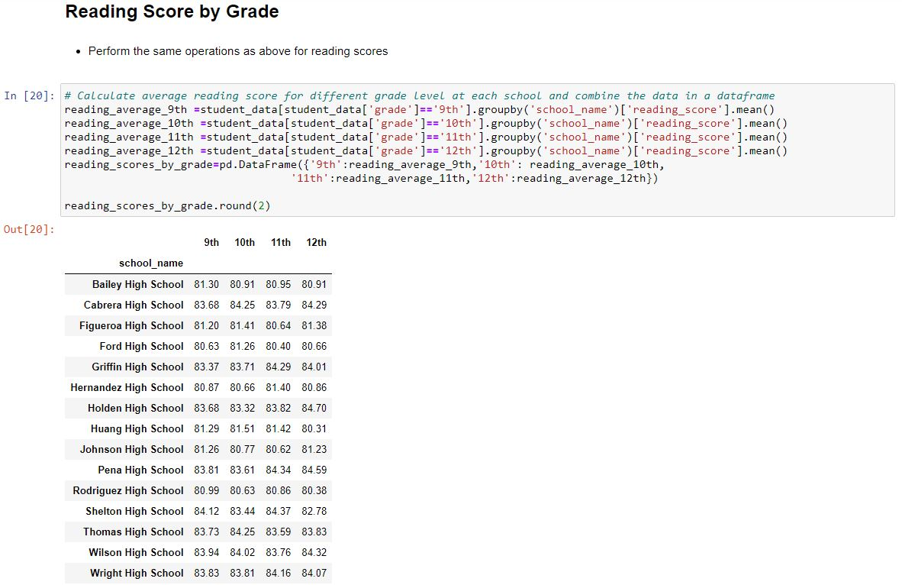

# Analyzing Trends in School Performance

## About The Project

### Background

* Work as the Chief Data Scientist for city's school district
* Help the  school board and mayor make strategic decisions regarding future school budgets and priorities.

### Built With

* Python Pandas
* Jupyter Notebook

### Dataset

* One CSV file with information about schools
* One CSV file with information about students

## Procedures

